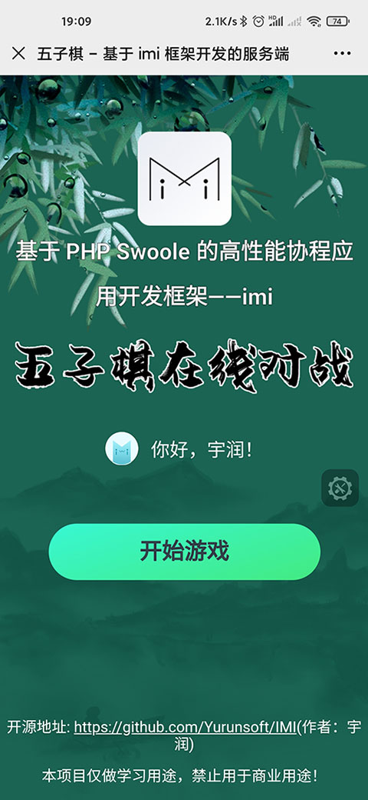
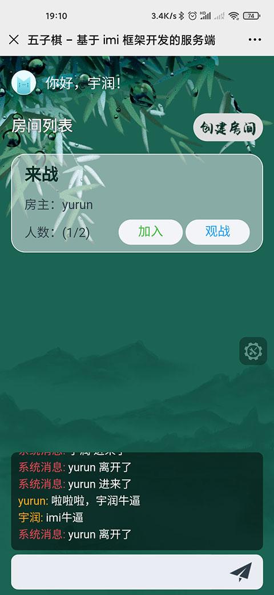
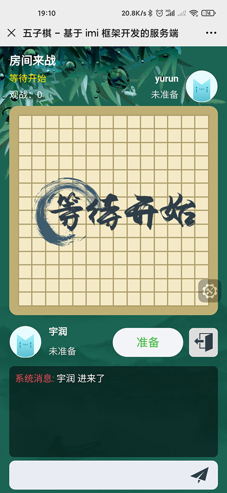
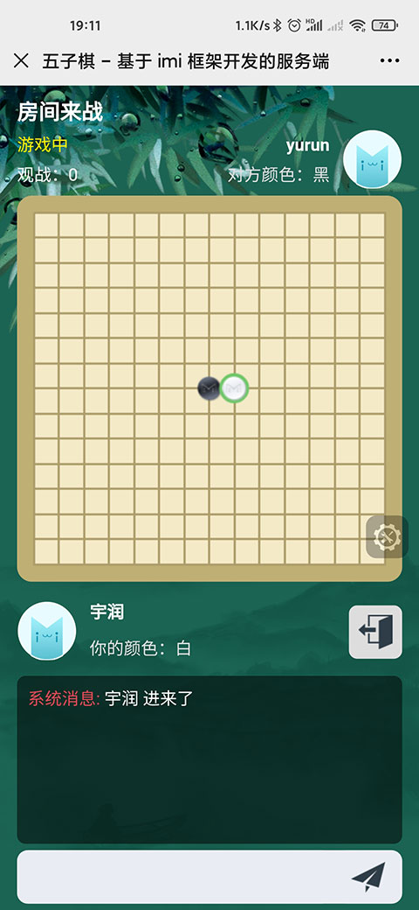
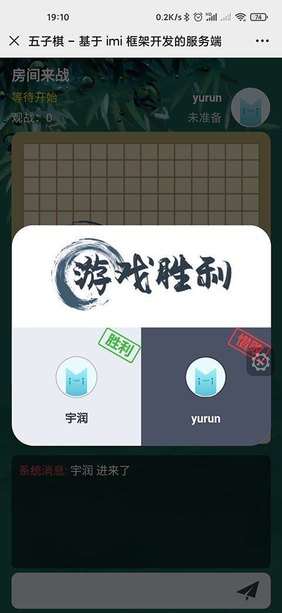

# imi-gobang

一款使用 imi 框架开发的五子棋在线对战系统。

本项目用于学习进阶 imi 实战视频教程，即将在 B 站免费连载，敬请期待！

<https://space.bilibili.com/768718>

项目基于 AGPL V3 协议开源。前端 UI 禁止商用！

演示地址：<https://test.yurunsoft.com/gobang/>

imi 框架交流群：17916227 [](https://jq.qq.com/?_wv=1027&k=5wXf4Zq)

## 技术栈

### 后端

[imi 框架](https://www.imiphp.com/)

[Swoole](https://www.swoole.com/)

[PHP](https://www.php.net/)

### 前端

[Vue](https://cn.vuejs.org/)

## 运行

### 服务端

**配置：**

`config/config.php` 中可以改端口

**运行命令：**

```shell
cd server
composer update
vendor/bin/imi server/start
```

### 前端页面

**配置：**

`vue.config.js` 中可以改端口

`.env` 中修改**正式**环境的接口 URL

`.env.development` 中修改**测试**环境的接口URL

**运行命令：**

```shell
cd h5
npm install
npm run serve
```

## 预览图






